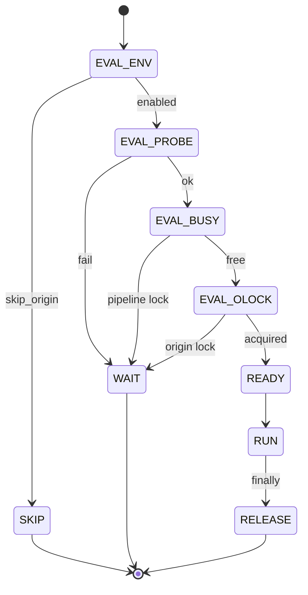

# data_pc_origin — 나노(Nano) 설계 트리

> **6단계 분해:** L0 → L1 → L2 → L3 → **L4 나노** → **L5 쿼크** → **L6 포톤**  
> L4: `DESIGN_ATOMIC.md` · **L7/L8:** [`DESIGN_LEPTON.md`](DESIGN_LEPTON.md) · **리프 카탈로그:** [`design/catalog/`](design/catalog/_INDEX.md)  
> 상위: `DESIGN.md` · 상태: `LAYER_STATUS.md`  
> **설계 전용** — 구현은 L4 `--gate`부터; L5–L8는 테스트·registry·픽스처 메타.

---

## ID · 롤업

```
O{L0}-{L1}-{L2}-{L3}-{L4}           # L4 — assert 1개
O{L0}-…-{L4}-Q{n}                   # L5 — PRE/EXEC/POST
O{L0}-…-{L4}-F{id}                  # L6 — 픽스처 (A,B,…,golden)
RG-* / FX-* / ER-* / SM-*           # 메타 (Origin 도메인 밖)
```

| L5 접미 | 역할 | verify 실패 |
|---------|------|-------------|
| Q1 | PRE — 타입·선행 게이트·입력 계약 | exit 3 CONTRACT |
| Q2…Qn-1 | EXEC — 함수 내부 1미시 연산 | L4 assert에 포함 |
| Qn | POST — 출력·불변식 | exit 1 ASSERT |

**롤업:** L5 AND → L4 → L3 → L2 → L1 → L0. 형제 L4는 `RG-D-03` 순서.

---

## 메타 — RG · ER · SM · FX

### RG — Gate Registry

| L2 | L4 | L5 |
|----|-----|-----|
| RG-D-01 DAG parent | L4→L3 | Q1 키 존재 Q2 사이클 없음 |
| RG-D-02 children | L3→[L4] | Q1 비어있지 않음 |
| RG-D-03 sibling order | total order | O0-K-01-a-1 < b-1 < … |
| RG-D-04 cross-L0 | O1→O0 | O5-M-01 → O0-K-02-b-1 |
| RG-V-01 `--gate ID` | 단일 L4 | parse→run→exit 0/1 |
| RG-V-02 `--quark` | L5 trace | 실패 쿼크명 stderr |
| RG-V-03 LOCKED | 부모 미PASS | exit 2 |
| RG-V-04 CONTRACT | L6 mismatch | exit 3 |
| RG-V-05 `--rollup` | 합본 gate | 첫 fail stop |
| RG-F-01 | `gates/registry.py` | |
| RG-F-02 | `gates/O0/O0_K_01_a_1.py` | 1 L4 = 1 파일 |
| RG-F-03 | `gates/O0/O0_K_01_a_1.yaml` | L5/L6 메타 |
| RG-F-04 | `fixtures/O0/K_01_d_1.json` | L6 공유 |

### ER — Exit · Warning

| Code | exit | when |
|------|------|------|
| ER-OK | 0 | pass |
| ER-ASSERT | 1 | L4 POST |
| ER-LOCKED | 2 | 선행 미PASS |
| ER-CONTRACT | 3 | L6 |
| ER-PROBE | 4 | O1 live |
| ER-ORIGIN | 5 | COM |
| ER-SKIP | 0 | O2 skip (정상) |

| warning | source |
|---------|--------|
| WKS_MISS | O5-M-04 |
| COL_INSERT_LT | O6-I-01 |
| PARTIAL_SHEETS | O8-J-07 |
| GAP_POLICY | O7-P-01 |

### SM-O2 — Gate FSM



### FX — 공유 픽스처 (L6)

| ID | 용도 | 필드 |
|----|------|------|
| FX-GC3-Ni5 | gap 107행 | `sample_name`, `df_col`, `row99`, `row100` |
| FX-OPJU-DRE | 워크시트 매칭 | `book.name`, `wks.name`, `book.lname` per sheet |
| FX-SAMPLE-DRE | column resolve | `20260620 DRE(1.5) 600C Ni5_Ce5_Al2O3` |
| FX-IDENTITY-DRE | identity_key | `("20260620","dre(1.5) 600c ni5_ce5_al2o3")` |

---

# O0 — Pure (L4별 L5·L6)

> O0 전 **58 L4** 리프. 각 L4 = Q1 PRE + Q2 EXEC + Q3 POST (파이프라인型은 Q4 POST).

## O0-T

| L4 | L5 | L6 |
|----|-----|-----|
| O0-T-01-a-1 tuple 2 | Q1 isinstance tuple Q2 len==2 Q3 both str | FA valid FB `(a,)` FC `(1,2)` |
| O0-T-01-b-1 date 8 | Q2 group[0].isdigit×8 | `"20260620"` |
| O0-T-02-a-1 enum 3 | Q2 {AS_EMPTY,AS_NAN,SKIP_ROWS} | |
| O0-T-02-b-1 str enum | Q3 issubclass(str,Enum) | |
| O0-T-03-a-1 ProbeResult | Q3 frozen ok:bool detail:str | |
| O0-T-04-a-1 OriginPath | Q3 NewType str | |

## O0-K

| L4 | L5 (micro-op) | L6 |
|----|---------------|-----|
| O0-K-01-a-1 | Q1 None Q2 call Q3 `""` | FIX-a-A null→"" |
| O0-K-01-b-1 | Q1 `""` Q3 `""` | |
| O0-K-01-c-1 | Q1 `" \t "` Q2 `\s+` strip Q3 `""` | |
| O0-K-01-d-1 | Q1 str Q2 lower Q3 ws-remove Q4 `h2yield` | A `"H2 yield"` B `"H2yield"` |
| O0-K-01-e-1 | same pipeline | `"  CO2 conversion "` |
| O0-K-01-f-1 | Q3 no upper in out | `"DRM"` |
| O0-K-01-g-1 | Q2 tab collapse | `"H2\tYield"` |
| O0-K-02-a-1 | Q2 norm(a)==norm(b) | pair table |
| O0-K-02-b-1 | Q2 `kw in search` after norm | h2yield⊂book1h2yieldwks |

## O0-I

| L4 | L5 | L6 sample |
|----|-----|-----------|
| O0-I-01-a-1 | Q1 `""` Q3 ∅ | |
| O0-I-01-b-1 | Q3 `dre`∈ | FX-SAMPLE-DRE |
| O0-I-01-c-1 | Q3 `drme`∈ | DRME sample |
| O0-I-01-d-1 | Q2 `@\d+` | `@600` |
| O0-I-01-e-1 | Q3 `ni5`,`ce5` | |
| O0-I-01-f-1 | Q3 no len-1 alone | `"a"`∉ |
| O0-I-01-g-1 | Q3 `0.15g`∈ | |
| O0-I-02-a-1 | Q2 \|∩\|/\|ref\| | mock sets |
| O0-I-02-b-1 | Q2 thr=max(2,⌈0.6n⌉) | n=3→2 n=5→3 |

## O0-C

| L4 | L5 |
|----|-----|
| O0-C-01-a-1 | Q1 None Q3 None |
| O0-C-01-b-1 | Q2 `^(\d{8})` Q3 capture |
| O0-C-01-c-1 | Q2 mid digits ignored |
| O0-C-01-d-1 | Q3 7 digits→None |
| O0-C-01-e-1 | Q1 strip lead |
| O0-C-02-a-1 | comment None→False |
| O0-C-02-b-1 | key None→False |
| O0-C-02-c-1 | date mismatch→False |
| O0-C-02-d-1 | date+tokens→True |
| O0-C-02-e-1 | casefold |
| O0-C-03-a-1 | no date→max sort key |

## O0-S

| L4 | L5 | L6 |
|----|-----|-----|
| O0-S-01-a-1 | None→True | |
| O0-S-01-b-1 | isnan→True | nan |
| O0-S-01-c-1 | 0.0→False | |
| O0-S-01-d-1 | `""`→False | |
| O0-S-02-a-1 | len preserved | 107 |
| O0-S-02-b-1 | NaN→`""` | idx 99,100 |
| O0-S-02-c-1 | finite unchanged | |
| O0-S-03-a-1 | len preserved | |
| O0-S-03-b-1 | out isnan | |
| O0-S-04-a-1 | len reduced | |
| O0-S-04-b-1 | non-gap order | |
| O0-S-05-a-1 | list pass-through | |
| O0-S-05-b-1 | Series.tolist | |
| O0-S-05-c-1 | empty→[] | |
| O0-S-06-a-1 | 107 rows GC3 | FX-GC3-Ni5 |
| O0-S-06-b-1 | gap `""` not 0 | golden |

## O0-M

| L4 | L5 |
|----|-----|
| O0-M-01-a-1 | len==8 |
| O0-M-01-b-1 | H2 Yield key |
| O0-M-01-c-1 | CH4 Conversion |
| O0-M-02-a-1 | {}→ValueError |
| O0-M-02-b-1 | empty df_col |
| O0-M-02-c-1 | empty kw |
| O0-M-02-d-1 | norm dup |
| O0-M-02-e-1 | copy not alias |
| O0-M-03-a-1 | skip missing cols |
| O0-M-03-b-1 | subset only |

### O0 L5 템플릿 (미열거 L4 공통)

```
Q1 PRE:  inputs typed, parents PASS (RG-V-03)
Q2 EXEC: single pure call / single regex / single branch
Q3 POST: equality | raises | len | membership
L6:      ≥1 positive + optional negative fixture
```

---

# O1 — Probes (L4 확장 + L5)

## O1-P — Opju path

| L4 | L5 | L6 |
|----|-----|-----|
| O1-P-01-a-1 | Q1 path="" Q3 ok=False | |
| O1-P-01-b-1 | Q1 `"   "` strip empty | |
| O1-P-02-a-1 | Q2 not isfile | `/no/such.opju` |
| O1-P-02-b-1 | Q2 symlink broken | mock |
| O1-P-03-a-1 | Q2 isdir→fail | |
| O1-P-04-a-1 | Q2 suffix `.opju` | |
| O1-P-04-b-1 | Q2 `.OPJU` | |
| O1-P-04-c-1 | Q2 `.opj` fail | |
| O1-P-05-a-1 | Q2 startswith `G:` | |
| O1-P-05-b-1 | Q2 normalize `g:`→`G:` | |
| O1-P-06-a-1 | Q2 EXPERIMENT_DATA_ROOT isdir | |
| O1-P-06-b-1 | Q3 detail has path | |
| O1-P-07-a-1 | Q2 all P01–06 pass | golden path |
| O1-P-07-b-1 | Q3 first fail code in detail | table |
| O1-P-07-c-1 | Q3 ProbeResult frozen | |

## O1-W — Writable

| L4 | L5 |
|----|-----|
| O1-W-01-a-1 | os.access R_OK |
| O1-W-01-b-1 | deny→fail |
| O1-W-02-a-1 | W_OK |
| O1-W-02-b-1 | read-only file fail |
| O1-W-03-a-1 | win32 ATTR_READONLY detect |
| O1-W-03-b-1 | cleared attr→pass |
| O1-W-04-a-1 | W01+W02+W03 aggregate |

## O1-I — Origin install

| L4 | L5 |
|----|-----|
| O1-I-01-a-1 | ImportError→ok=False |
| O1-I-01-b-1 | success→module ref |
| O1-I-02-a-1 | tasklist Origin64 (info) |
| O1-I-02-b-1 | not running still ok |
| O1-I-03-a-1 | I01 aggregate |

### O1 합본 L5

| ID | L5 |
|----|-----|
| O1-P | all O1-P-* L4 |
| O1-W | all O1-W-* |
| O1-I | all O1-I-* |
| O1 | O1-P+W+I + `--live` one real opju |

---

# O2 — Gate (L4→L5)

## O2-E — Env

| L4 | L5 |
|----|-----|
| O2-E-01-a-1 | unset→`""` |
| O2-E-01-b-1 | strip+lower |
| O2-E-02-a-1 | truthy set {1,true,yes,on} |
| O2-E-02-b-1 | else False |
| O2-E-03-a-1 | DATA_PC_SKIP_ORIGIN |
| O2-E-04-a-1 | not skip |

## O2-L — Lock

| L4 | L5 |
|----|-----|
| O2-L-01-a-1 | lock file exists |
| O2-L-01-b-1 | pid int parse |
| O2-L-01-c-1 | pid alive (psutil) |
| O2-L-02-a-1 | lock+alive→busy |
| O2-L-03-a-1 | path KCH/.origin_update.lock |
| O2-L-04-a-1 | O_EXCL create |
| O2-L-04-b-1 | stale pid unlink retry |
| O2-L-04-c-1 | timeout→fail |
| O2-L-05-a-1 | finally unlink |

## O2-G — Chain

| L4 | L5 |
|----|-----|
| O2-G-01-a-1 | skip→verdict SKIP |
| O2-G-02-a-1 | probe fail→WAIT+detail |
| O2-G-03-a-1 | pipeline busy→WAIT |
| O2-G-04-a-1 | origin lock→WAIT |
| O2-G-05-a-1 | all pass→READY |
| O2-G-06-a-1 | GateVerdict frozen fields |

---

# O3 — Session (L4→L5)

| L4 | L5 |
|----|-----|
| O3-S-01-a-1 | module cache hit |
| O3-S-01-b-1 | ImportError propagate |
| O3-S-02-a-1 | set_show(False) once |
| O3-S-03-a-1 | oext False→True |
| O3-S-04-a-1 | op.exit() |
| O3-S-04-b-1 | oext False after |
| O3-S-05-a-1 | exc path still exit |
| O3-S-06-a-1 | CM `__enter__`/`__exit__` |
| O3-P-01-a-1 | PluginProtocol hooks |
| O3-P-02-a-1 | register order |
| O3-P-03-a-1 | DialogReadonly default off |
| O3-P-04-a-1 | RetryOpen max_retries=0 |

---

# O4 — Project (L4→L5)

| L4 | L5 |
|----|-----|
| O4-V-01-a-1 | delegate O1-P-07 |
| O4-O-01-a-1 | open no asksave dialog |
| O4-O-01-b-1 | return bool |
| O4-O-01-c-1 | False→OriginOpenError |
| O4-O-02-a-1 | plugin retry 1x |
| O4-S-01-a-1 | save same path |
| O4-S-02-a-1 | save_as suffix |
| O4-R-01-a-1 | open→save→exit smoke |

---

# O5 — Worksheet find (고위험 — **105 core / 117 total L4**)

> **증상:** `일치하는 데이터 시트…` → `O5-M-03-l-1` · E2E-02  
> **마스터:** [`O5-REGISTRY.md`](design/catalog/O5-REGISTRY.md) #1–117

| L1 | L2 | L4 | L5 EXEC chain (요약) |
|----|-----|-----|----------------------|
| I | I-01 | 12 | pages attr→'w'→1call→lazy→ORD |
| I | I-02 | 12 | tuple→identity→8wks→count |
| T | T-01..03 | 15 | name/lname/wks raw str |
| T | T-04 | 12 | 3×CALL→f-string L1709→golden |
| M | M-01 | 14 | guard→2×norm→in→C1–C5 |
| M | M-02 | 14 | iter→compose→match→break×2 |
| M | M-03 | 18 | mapping loop→symptom l-1 |
| M | M-04 | 8 | WKS_MISS aggregate |
| DBG | DEBUG | 5 | norm/search log |
| E2E | E2E | 3 | 8/8 · 0/8 · partial |
| R | R | 4 | L1 rollup smoke |

### O5 구현 형제 순서

```
O5-REGISTRY #1 … #105 (core)
→ #106–110 DEBUG (opt)
→ #111–113 E2E
→ #114–117 R
```

---

# O6 — Column (L4→L5)

| L4 | L5 | 비고 |
|----|-----|------|
| O6-S-01-a-1 | Q2 range(1,wks.cols) | |
| O6-S-02-a-1 | Q2 (idx, parse_date) list | |
| O6-F-01-a-1 | Q2 strip(comment)==sample | exact 우선 |
| O6-F-02-a-1 | Q2 O0-C-02 | identity 2nd |
| O6-P-01-a-1 | Q2 parse sample date | |
| O6-P-02-a-1 | Q2 insert when new<existing | |
| O6-P-03-a-1 | Q2 no date→last+1 | |
| O6-P-04-a-1 | Q2 label nonempty | |
| O6-I-01-a-1 | Q2 LT_execute insert col | W COL_INSERT_LT |
| O6-I-02-a-1 | Q2 if occupied→I-01 | |
| O6-R-01-a-1 | Q2 exact>identity>insert | |
| O6-R-01-b-1 | Q3 same idx all sheets O8-J-04 | |

---

# O7 — Write (L4→L5)

| L4 | L5 |
|----|-----|
| O7-P-01-a-1 | default AS_EMPTY |
| O7-P-01-b-1 | env override optional |
| O7-P-02-a-1 | O0-S-05 dispatch |
| O7-W-01-a-1 | from_list(col, vals, comments=) |
| O7-W-01-b-1 | comments=sample_name |
| O7-W-02-a-1 | H2 smoke 107 rows |
| O7-W-03-a-1 | loop mapping subset |
| O7-G-01-a-1 | idx 99,100 `""` |
| O7-G-02-a-1 | not 0.0 |

---

# O8 — Job (L4→L5)

| L4 | L5 |
|----|-----|
| O8-C-01-a-1 | fields frozen |
| O8-C-02-a-1 | validate_mapping+mapping_for_df |
| O8-J-01-a-1 | O2 READY only |
| O8-J-02-a-1 | session CM |
| O8-J-03-a-1 | O4 open |
| O8-J-04-a-1 | resolve col on first wks reuse |
| O8-J-05-a-1 | for kw: O5 find → O7 write |
| O8-J-06-a-1 | save in place |
| O8-J-07-a-1 | partial sheets ok + warns |
| O8-J-08-a-1 | SampleJobResult counts |
| O8-J-09-a-1 | finally save+exit even 0 |

---

# O9 — Facade (L4→L5)

| L4 | L5 |
|----|-----|
| O9-F-01-a-1 | signature match 촉매 update_origin |
| O9-F-02-a-1 | delegates O8 |
| O9-F-03-a-1 | OriginUpdateResult fields |
| O9-F-04-a-1 | log `[Origin]` |
| O9-F-05-a-1 | print 4단계 UX |
| O9-E2E-01-a-1 | real Ni5 opju+xlsx |
| O9-E2E-02-a-1 | gap NaN→"" in Origin col |

---

# 구현 순서 (L4 리프 — L5 포함)

```
Phase 0  RG-F-01..04 + RG-V-01..05 (registry skeleton)
Phase 1  O0-* L4 each with L5 yaml (58 gates)
Phase 2  O1-* (32 gates) — O0 + 승인
Phase 3  O2-* (22 gates)
Phase 4  O3-O4 (20 gates)
Phase 5  O5-* (**105 core** gates) ← worksheet miss root
Phase 6  O8-O9 (18 gates + 2 E2E)
```

---

# 수치 요약

| 레벨 | 설계 개수 |
|------|-----------|
| L0 | 10 (O0~O9) + 4 meta |
| L1 | ~40 |
| L2 | ~95 |
| L3 | ~200 |
| **L4 나노** | **~400+** (O5 117 포함) |
| **L5 쿼크** | **~900** (L4당 평균 2.8) |
| **L6 포톤** | **~450** (L4당 1~3) |
| **L7 레pton** | **~2,400** — [`DESIGN_LEPTON.md`](DESIGN_LEPTON.md) |
| **L8 bit** | **~1,200** — [`design/catalog/`](design/catalog/_INDEX.md) |

---

# 촉매 파이프라인 대응 (참조만)

| 촉매 `update_origin` | data_pc_origin |
|----------------------|----------------|
| `_normalize_origin_key` | O0-K-01 |
| `_identity_match_tokens` | O0-I-01 |
| `_comment_matches_identity` | O0-C-02 |
| `_find_worksheet_column_for_sample` | O6-R-01 |
| `df_col.tolist()` (gap 미처리) | O7-P-02 + O0-S (AS_EMPTY) |
| worksheet keyword loop | O8-J-05 = O5+O7 |

`DATA_PC_SKIP_ORIGIN=1` — O9 PASS·승인 전 연결 없음.
