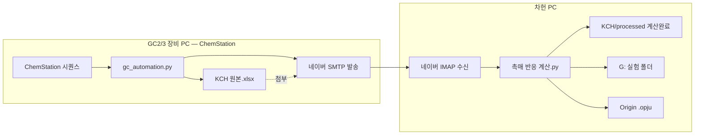

# GC 촉매 반응 자동화 — GC1·은규 인수인계 설명서

> **repo 위치:** `https://github.com/gjtuc/GC-auto`  
> **데이터 PC 스크립트:** `data_pc/촉매 반응 계산.py`  
> **GC1 장비 (은규):** Autochro PDF 파이프라인 — zip의 ChemStation GC1 설명과 다를 수 있음. repo `gc_autochro`/`gc_gc1` 기준.

> **작성:** 차헌 (GC2·GC3 사용자 / 차헌 PC)  
> **대상:** 은규 (GC1 사용자 / 은규 PC) 및 GC1 장비 PC  
> **목적:** 차헌이 실제 운용 중인 파이프라인이 **어떻게 동작하는지** 먼저 이해한 뒤,  
> **GC1 장비 PC가 아니라 은규 PC에서** 돌려야 한다는 점을 명확히 전달

---

## 1. 가장 중요한 한 줄

| PC | 누가 쓰나 | 무엇을 실행하나 | 데이터 소스 |
|----|-----------|----------------|-------------|
| **GC1 장비 PC** (Autochro 옆 PC) | 은규 | repo `gc_automation.py` — PDF → KCH xlsx → **메일 발송** | **Autochro UI → PDF** (ChemStation 아님) |
| **은규 PC** (업무·Origin PC) | 은규 | `data_pc/촉매 반응 계산.py` — **메일 수신** → 계산 → G: → Origin | 장비 PC가 보낸 KCH xlsx |

> **GC2/GC3(차헌)** 는 ChemStation `sequence.acam_` / Chem32 `Report.txt` 입니다.  
> 아래 §3-1은 **GC1(Autochro)** 과 **GC2/GC3(ChemStation)** 을 구분해 적었습니다.

**GitHub repo(`GC-auto`)를 GC1 장비 PC에서 먼저 읽는 이유**는,  
연구실 전체 자동화 구조를 이해시키기 위함입니다.

하지만 **수율/전환율·G:·Origin은 GC1 장비 PC가 아니라 은규 PC에서만** 실행합니다.  
메일 계정·Origin·G:·`machine_profile` 이 사람·PC마다 다르기 때문입니다.

---

## 2. 사람·장비·PC 관계 (반드시 구분)

```
차헌 (연구원)
  ├─ GC2 장비 PC  ── gc_automation.py ── 메일 발송
  ├─ GC3 장비 PC  ── (동일 구조, DRME용)
  └─ 차헌 PC ── 촉매 반응 계산.py ── 메일 수신·계산·G:·Origin

은규 (연구원)  ← 이번 인수인계 대상
  ├─ GC1 장비 PC  ── gc_automation.py (GC1용으로 조정 필요)
  └─ 은규 PC ── 촉매 반응 계산.py (GC1용으로 조정 필요)
```

| 구분 | 차헌 (현재 운용) | 은규 (앞으로 운용) |
|------|------------------|-------------------|
| GC 장비 | GC2 (DRE·DRM), GC3 (DRME) | **GC1** (담당 반응 확인 필요) |
| 장비 PC 스크립트 | `gc_automation.py` | 동일 계열, **GC1 경로·메일 수신자 수정** |
| PC 종류 | 차헌 PC | **은규 PC** (새 `machine_profile` 작성) |
| 네이버 메일 | 차헌 계정 | **은규 본인 계정** (env 별도) |
| Origin | 차헌 PC에 설치 | **은규 PC에 Origin 설치·라이선스** |
| G: 드라이브 | 연구소 공용 경로 (동일) | 동일 경로, **SecuYouSB는 은규가 직접 로그인** |

**같은 코드를 복사만 하면 안 됩니다.**  
장비 교정 상수(CALIB), 피크 RT 구간(TIME), 메일 계정, PC 식별 정보는 **사람·장비마다 다릅니다.**

---

## 3. 전체 파이프라인 (차헌이 지금 돌리는 방식)



### 3-1a. GC1 장비 PC — `gc_automation.py` (1단계, 은규)

**YL6500 + Autochro-3000.** ChemStation `.D` 폴더를 쓰지 않습니다.

1. iPhone 핫스팟 연결(또는 force) → `gc_autochro.py` 가 Autochro에서 **Hancom PDF** 저장
2. `gc_gc1.py` 가 PDF 피크를 파싱·trim → KCH xlsx (**FID + TCD** 2시트)
3. `Desktop\박은규\YYYYMMDD 시료.xlsx` 저장
4. SMTP로 **은규 PC** 메일에 첨부 (KCH **원본** — 계산 완료 아님)

**실행 예 (GC1 장비 PC):**
```powershell
python gc_automation.py --show-profile          # gc1, iPhone 확인
# 일상: GC1_감시시작.bat  /  수동: GC1_동작해줘.bat 또는 --user-message "진행"
```

상세: [`docs/GC1_장비PC_README.md`](GC1_장비PC_README.md), [`deploy/GC1_Cursor_핸드오프.md`](../deploy/GC1_Cursor_핸드오프.md)

### 3-1b. GC2/GC3 장비 PC — `gc_automation.py` (1단계, 차헌)

ChemStation 시퀀스 종료 후 `Data` 아래 `F-날짜-....D` 주입 폴더마다 `sequence.acam_`(GC2) 또는 `Report.txt`(GC3) 를 읽어 KCH xlsx 생성 후 **차헌 PC** 메일로 발송.

```powershell
python gc_automation.py --sequence-date 20260613 --sample-name "시료이름"   # GC2/GC3
```

> **공통:** 메일 첨부는 항상 KCH **원본**. 수율/전환율은 **은규 PC** 또는 **차헌 PC**의 `촉매 반응 계산.py` 가 처리합니다.

### 3-2. 은규 PC / 차헌 PC — `촉매 반응 계산.py` (2~4단계)

| 단계 | 내용 | 출력 |
|------|------|------|
| 1 | 네이버 IMAP — 받은·보낸·내게쓴(미읽음) 메일에서 xlsx 수신 | `KCH/inbox/` |
| 2 | Area → ppm → 수율·전환율 계산 (GC2/GC3 교정식 적용) | `KCH/processed/` |
| 3 | G: 반응별 최신 폴더 복사 → 새 실험 폴더 생성, 중복 폴더 정리 | `G:\연구소\실험\...` |
| 4 | Origin `.opju` 워크시트에 새 시료 열(Comments) 추가 | G: 폴더 내 `.opju` |

**실행 (은규 PC 또는 차헌 PC):**
```powershell
python "촉매 반응 계산.py"
```

**G:가 안 보이면:** SecuYouSB에서 보안 USB 직접 로그인 → 스크립트 재실행.  
2단계 계산 결과는 `KCH/processed/`에 남습니다.

---

## 4. GitHub repo를 **어느 PC에서** 어떻게 쓰나

> **통합 repo:** https://github.com/gjtuc/GC-auto  
> (예전 zip `GC1-촉매반응자동화_인수인계` 구조는 **폐기** — 아래 repo 구조 기준)

### Step A — GC1 장비 PC (은규, 1단계 이해)

1. `git clone` 또는 `git pull` → `C:\Users\User\chemstation-gc-automation`
2. **본 문서** + [`docs/GC1_장비PC_README.md`](GC1_장비PC_README.md) + [`deploy/GC1_Cursor_핸드오프.md`](../deploy/GC1_Cursor_핸드오프.md) 읽기
3. repo 루트 `gc_automation.py` · `gc_autochro.py` · `gc_gc1.py` 로 **Autochro→PDF→메일** 이해
4. `data_pc/촉매 반응 계산.py` 는 **은규 PC에서만 실행** — 장비 PC에서는 참고만

> GC1 장비 PC에서 `촉매 반응 계산.py` 를 일상 실행하지 마세요. Origin·G: 는 은규 PC 환경입니다.

### Step B — 은규 PC (2~4단계)

1. 동일 repo `git pull`
2. `data_pc/` → `Desktop\.cursor\` 복사 ([`deploy/STEP3_data_pc.md`](../deploy/STEP3_data_pc.md))
3. `gc_automation.env.example` → `Desktop\.cursor\gc_automation.env` (은규 **IMAP** 계정)
4. `machine_profile.json` 작성 (`deploy/machine_profile.template.data_pc.json`)
5. GC1 CALIB 실측 ([`deploy/STEP7_gc1_calib.md`](../deploy/STEP7_gc1_calib.md)) 후 `python "촉매 반응 계산.py"` 테스트

### Step C — GC1 장비 PC 메일 연동

`Desktop\박은규\gc_automation.env` 의 `MAIL_TO` = **은규 PC**가 읽는 네이버 주소.

- 코드 `gc_config.TARGET_EMAIL` 기본값(`kimcha0809@...`)은 **차헌 레거시** — env `MAIL_TO`가 실제 발송 수신자
- GC1 운영 예: `john3556@naver.com` ([`deploy/gc_automation.env.gc1`](../deploy/gc_automation.env.gc1) 참고)

---

## 5. GC1으로 옮길 때 반드시 바꿀 것

### 5-1. `촉매 반응 계산.py` — USER SETTINGS (약 109~131행)

차헌 사본은 **GC2·GC3** 기준입니다:

| 변수 | GC2 | GC3 | GC1 (은규 — **미입력, 실측 필요**) |
|------|-----|-----|-----------------------------------|
| 초기 feed ppm | DRE/DRM용 | DRME용 | GC1 담당 반응에 맞게 |
| CALIB (Area↔ppm) | 곱셈 계수 | 나눗셈 계수 | GC1 KCH·표준가스로 산출 |
| TIME (RT 구간) | H2 0.4~0.55 등 | TCD/FID 분리 | GC1 크로마토그램으로 측정 |
| 장비 자동 판별 | H2 RT로 GC2 vs GC3 | 동일 | **GC1 구간 추가** 필요 |

GC1이 DRE만 한다면 GC2 블록을 참고하고, DRM/DRME면 해당 블록을 참고하되 **숫자는 GC1 실측값**으로 교체합니다.

### 5-2. `gc_automation.py` — GC1 장비 PC 설정

| 항목 | 확인·수정 |
|------|-----------|
| `EXCEL_OUTPUT_DIR` | `Desktop\박은규` (GC1 PDF·xlsx·watch 상태) |
| `MAIL_TO` / `NAVER_EMAIL` | **은규 PC** IMAP 계정 (env 우선; 코드 `TARGET_EMAIL` 기본값은 차헌 레거시) |
| `REQUIRED_HOTSPOT` | `iPhone` (GC2의 AndroidHotspot과 다름) |
| `AUTOCHRO_ENABLED` | `1` — Autochro UI 자동화 |

> GC1은 `DEFAULT_CHEMSTATION_DATA` / `--sequence-date` 를 **사용하지 않습니다.**  
> ChemStation 항목은 GC2/GC3 장비 PC용입니다.

### 5-3. `gc_automation.env` — 은규 PC (은규 전용)

```
NAVER_EMAIL=은규@naver.com
NAVER_APP_PASSWORD=16자리_앱비밀번호
MAIL_TO=은규@naver.com
```

차헌의 비밀번호·토큰은 **이 패키지에 포함하지 않았습니다.**

### 5-4. `machine_profile.json` — PC 식별

데이터 PC마다 SMBIOS UUID·MachineGuid 등을 기록해 두면,  
Cursor/에이전트가 “이 PC는 GC 장비 PC가 아니라 은규 PC”임을 구분할 수 있습니다.

`KCH/machine_profile.template.json` 을 채운 뒤 `machine_profile.json` 으로 저장하세요.

---

## 6. G: 드라이브·실험 폴더 (연구소 공통)

반응별 저장 루트 (차헌·은규 동일):

| 반응 | G: 경로 |
|------|---------|
| DRE | `G:\연구소\실험\실험데이터\촉매 반응\DRE 반응(C2H6)` |
| DRM | `G:\연구소\실험\실험데이터\촉매 반응\DRM 반응 (CH4)` |
| DRME | `G:\연구소\실험\실험데이터\촉매 반응\DRME 반응 (C2H6+CH4)` |

3단계: 반응 루트에서 **가장 최신 실험 폴더**를 복사 → 새 시료명으로 폴더·파일명 변경 → 계산 xlsx 배치.  
4단계: 복사된 `.opju` 에 새 시료 열 추가.

**중복 폴더:** 날짜만 다르고 시료가 같으면 xlsx 내용 비교 후 주입 수가 많은 쪽만 남김 (Canonical Chain).

---

## 7. GitHub repo 폴더 구성 (2026-06 통합 이후)

```
GC-auto/                              ← https://github.com/gjtuc/GC-auto
├── gc_automation.py                  ← 장비 PC CLI (GC1·GC2·GC3 공통 진입)
├── gc_autochro.py, gc_gc1.py         ← GC1 전용 (Autochro PDF)
├── gc_chemstation.py, gc_chem32.py   ← GC2/GC3 전용
├── data_pc/
│   ├── 촉매 반응 계산.py             ← 은규 PC / 차헌 PC 에서만 실행
│   ├── gc_automation.env.example     ← 데이터 PC IMAP용 (박은규/KCH env 와 별개)
│   └── KCH/inbox, processed/
├── deploy/                           ← env 템플릿, Step 가이드, 핸드오프
├── docs/                             ← 본 문서, PC_NAMING, CODEBASE_GUIDE
└── scripts/                          ← GC1 RT/CALIB 실측 도우미
```

**로컬만 (Git 제외):** 각 PC의 `gc_automation.env`, `machine_profile.json` 실본

---

## 8. 자주 헷갈리는 점

| 질문 | 답 |
|------|-----|
| GC1도 ChemStation인가? | **아님.** Autochro PDF. ChemStation 설명은 GC2/GC3용 |
| GC1 장비 PC에서 계산.py 돌려도 되나? | **안 됨.** Origin·G:·메일 수신은 **은규 PC** 기준 |
| gc_automation.py 는 어디서 돌리나? | **GC1 장비 PC** (Autochro 옆) / **GC2·GC3 장비 PC** (ChemStation 옆) |
| 차헌 메일을 그대로 써도 되나? | **안 됨.** 은규 계정·앱비밀번호 별도 |
| GC2 교정값을 GC1에 써도 되나? | **안 됨.** 장비·컬럼·검출기가 다르면 RT·CALIB 전부 재측정 |
| G: 경로는 사람마다 다른가? | 연구소 공용 경로 **동일**, USB 로그인은 **각자** |

---

## 9. 은규 PC 세팅 체크리스트

- [ ] Python 3 + `pandas`, `openpyxl`, `python-dotenv`, `originpro` (Origin 연동 시)
- [ ] `Desktop\.cursor\` 에 스크립트·KCH·env 배치
- [ ] `gc_automation.env` — 은규 네이버 IMAP/SMTP 앱비밀번호
- [ ] `machine_profile.json` — 은규 PC 시스템 ID 기록
- [ ] GC1 CALIB·TIME 실측 후 `촉매 반응 계산.py` 반영
- [ ] GC1 장비 PC `gc_automation.py` 수신 메일 → 은규 주소
- [ ] G: SecuYouSB 로그인 후 end-to-end 테스트 1회
- [ ] Origin 설치·`.opju` 템플릿 경로 확인

---

## 10. 문의·인수

- 파이프라인 설계·차헌 운용 경험: **차헌**
- GC1 장비·Autochro·실측 교정: **은규** (GC1 담당자)
- 코드 수정 시 **어느 PC용인지**(장비 PC vs 은규 PC/차헌 PC) 먼저 확인

---

*이 문서는 2026-06-18 기준 차헌 PC 운용 사본을 바탕으로 작성되었습니다.*
