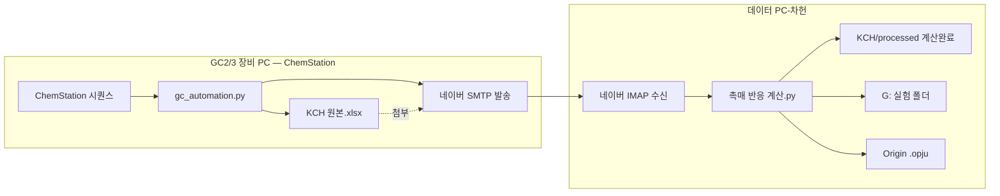

# GC 촉매 반응 자동화 — GC1·은규 인수인계 설명서

> **repo 위치:** `https://github.com/gjtuc/GC-auto`  
> **데이터 PC 스크립트:** `data_pc/촉매 반응 계산.py`  
> **GC1 장비 (은규):** Autochro PDF 파이프라인 — zip의 ChemStation GC1 설명과 다를 수 있음. repo `gc_autochro`/`gc_gc1` 기준.

> **작성:** 차헌 (GC2·GC3 사용자 / 데이터 PC-차헌)  
> **대상:** 은규 (GC1 사용자 / 데이터 PC-은규) 및 GC1 ChemStation 장비 PC  
> **목적:** 차헌 PC에서 실제 운용 중인 파이프라인이 **어떻게 동작하는지** 먼저 이해한 뒤,  
> **GC1 장비 PC가 아니라 데이터 PC-은규에서** 돌려야 한다는 점을 명확히 전달

---

## 1. 가장 중요한 한 줄

| PC | 누가 쓰나 | 무엇을 실행하나 |
|----|-----------|----------------|
| **GC1 장비 PC** (ChemStation 붙은 PC) | 은규 | `gc_automation.py` — 시퀀스 → KCH 엑셀 → **메일 발송** |
| **데이터 PC-은규** (일반 업무 PC) | 은규 | `촉매 반응 계산.py` — **메일 수신** → 계산 → G: → Origin |

**지금 이 압축 파일을 GC1 장비 PC에서 먼저 열어보는 이유**는,  
“우리 연구실이 이런 식으로 자동화하고 있다”는 **전체 그림**을 보여주기 위함입니다.

하지만 **수율/전환율 계산·G: 저장·Origin 반영은 GC1 장비 PC가 아니라 데이터 PC-은규에서** 해야 합니다.  
사용자·메일 계정·PC 고유 ID·Origin 설치 환경이 전부 다르기 때문입니다.

---

## 2. 사람·장비·PC 관계 (반드시 구분)

```
차헌 (연구원)
  ├─ GC2 장비 PC  ── gc_automation.py ── 메일 발송
  ├─ GC3 장비 PC  ── (동일 구조, DRME용)
  └─ 데이터 PC-차헌 ── 촉매 반응 계산.py ── 메일 수신·계산·G:·Origin

은규 (연구원)  ← 이번 인수인계 대상
  ├─ GC1 장비 PC  ── gc_automation.py (GC1용으로 조정 필요)
  └─ 데이터 PC-은규 ── 촉매 반응 계산.py (GC1용으로 조정 필요)
```

| 구분 | 차헌 (현재 운용) | 은규 (앞으로 운용) |
|------|------------------|-------------------|
| GC 장비 | GC2 (DRE·DRM), GC3 (DRME) | **GC1** (담당 반응 확인 필요) |
| 장비 PC 스크립트 | `gc_automation.py` | 동일 계열, **GC1 경로·메일 수신자 수정** |
| 데이터 PC | 차헌 PC (`machine_profile` 기록됨) | **은규 PC** (새 `machine_profile` 작성) |
| 네이버 메일 | 차헌 계정 | **은규 본인 계정** (env 별도) |
| Origin | 차헌 PC에 설치 | **은규 PC에 Origin 설치·라이선스** |
| G: 드라이브 | 연구소 공용 경로 (동일) | 동일 경로, **SecuYouSB는 은규가 직접 로그인** |

**같은 코드를 복사만 하면 안 됩니다.**  
장비 교정 상수(CALIB), 피크 RT 구간(TIME), 메일 계정, PC 식별 정보는 **사람·장비마다 다릅니다.**

---

## 3. 전체 파이프라인 (차헌이 지금 돌리는 방식)



### 3-1. GC 장비 PC — `gc_automation.py` (1단계)

ChemStation이 시퀀스를 끝내면 `Data` 폴더 아래에 주입(injection)마다 `F-날짜-시간-....D` 폴더가 수백 개 생깁니다.

`gc_automation.py`가 하는 일:

1. 지정한 시퀀스 폴더에서 각 `.D` 폴더의 `sequence.acam_` (ACAML XML) 파싱
2. 주입별 피크를 KCH 엑셀 형식(사이클 블록 + 헤더 반복)으로 통합
3. `YYYYMMDD 시료이름.xlsx` 로 저장
4. 네이버 SMTP로 **데이터 PC가 받을 메일** 발송 (첨부: KCH 원본)

> 메일로 가는 파일은 **계산 완료 파일이 아니라 KCH 원본**입니다.  
> 수율/전환율 계산은 데이터 PC에서 합니다.

**실행 예 (장비 PC):**
```powershell
python gc_automation.py --sequence-date 20260613 --sample-name "시료이름"
```

### 3-2. 데이터 PC — `촉매 반응 계산.py` (2~4단계)

| 단계 | 내용 | 출력 |
|------|------|------|
| 1 | 네이버 IMAP — 받은·보낸·내게쓴(미읽음) 메일에서 xlsx 수신 | `KCH/inbox/` |
| 2 | Area → ppm → 수율·전환율 계산 (GC2/GC3 교정식 적용) | `KCH/processed/` |
| 3 | G: 반응별 최신 폴더 복사 → 새 실험 폴더 생성, 중복 폴더 정리 | `G:\연구소\실험\...` |
| 4 | Origin `.opju` 워크시트에 새 시료 열(Comments) 추가 | G: 폴더 내 `.opju` |

**실행 (데이터 PC):**
```powershell
python "촉매 반응 계산.py"
```

**G:가 안 보이면:** SecuYouSB에서 보안 USB 직접 로그인 → 스크립트 재실행.  
2단계 계산 결과는 `KCH/processed/`에 남습니다.

---

## 4. 이 패키지를 **어디서** 어떻게 보나

### Step A — GC1 장비 PC에서 (지금 단계)

1. 이 ZIP을 GC1 장비 PC로 복사
2. **`00_먼저_읽기_인수인계_설명.md`** (본 문서)와 **`01_장비PC_GC1/README_장비PC.md`** 를 읽기
3. `01_장비PC_GC1/gc_automation.py` 코드·주석으로 **1단계(엑셀 생성·메일 발송)** 동작 이해
4. `02_데이터PC_은규/촉매 반응 계산.py` 는 **“최종 실행은 데이터 PC”** 참고용으로만 열람

> GC1 장비 PC에서 `촉매 반응 계산.py` 를 **일상적으로 실행하지 마세요.**  
> Origin·G: 드라이브는 데이터 PC 쪽 환경입니다.

### Step B — 데이터 PC-은규에서 (다음 단계)

1. `02_데이터PC_은규/` 폴더 전체를 은규 PC의 `Desktop\.cursor\` 에 배치 (권장 구조)
2. `gc_automation.env.example` → `gc_automation.env` 로 복사 후 **은규 네이버 계정** 입력
3. `KCH/machine_profile.template.json` → `machine_profile.json` 작성 (은규 PC 시스템 정보 기록)
4. GC1 전용 **교정 상수·RT 구간**을 실측 후 `촉매 반응 계산.py` USER SETTINGS 에 반영
5. `python "촉매 반응 계산.py"` 테스트

### Step C — GC1 장비 PC 메일 연동

`gc_automation.py` 의 수신 메일 주소를 **은규 데이터 PC가 읽는 네이버 주소**로 변경.  
(현재 차헌 사본은 `kimcha0809@naver.com` 으로 하드코딩되어 있음 — 반드시 수정)

---

## 5. GC1으로 옮길 때 반드시 바꿀 것

### 5-1. `촉매 반응 계산.py` — USER SETTINGS (약 109~131행)

차헌 사본은 **GC2·GC3** 기준입니다:

| 변수 | GC2 | GC3 | GC1 (은규 — **미입력, 실측 필요**) |
|------|-----|-----|-----------------------------------|
| 초기 feed ppm | DRE/DRM용 | DRME용 | GC1 담당 반응에 맞게 |
| CALIB (Area↔ppm) | 곱셈 계수 | 나눗셈 계수 | GC1 KCH·표준가스로 산출 |
| TIME (RT 구간) | H2 0.4~0.55 등 | TCD/FID 분리 | GC1 크로마토그램으로 측정 |
| 장비 자동 판별 | H2 RT로 GC2 vs GC3 | 동일 | **GC1 구간 추가** 필요 |

GC1이 DRE만 한다면 GC2 블록을 참고하고, DRM/DRME면 해당 블록을 참고하되 **숫자는 GC1 실측값**으로 교체합니다.

### 5-2. `gc_automation.py` — 장비 PC 설정

| 항목 | 확인·수정 |
|------|-----------|
| `DEFAULT_CHEMSTATION_DATA` | GC1 ChemStation Data 경로 |
| `EXCEL_OUTPUT_DIR` | GC1 PC의 KCH 저장 위치 |
| `TARGET_EMAIL` / SMTP 수신 | **은규 데이터 PC 메일** |
| `.env` (장비 PC) | 은규 발송용 네이버 계정 |

### 5-3. `gc_automation.env` — 데이터 PC (은규 전용)

```
NAVER_EMAIL=은규@naver.com
NAVER_APP_PASSWORD=16자리_앱비밀번호
MAIL_TO=은규@naver.com
```

차헌의 비밀번호·토큰은 **이 패키지에 포함하지 않았습니다.**

### 5-4. `machine_profile.json` — PC 식별

데이터 PC마다 SMBIOS UUID·MachineGuid 등을 기록해 두면,  
Cursor/에이전트가 “이 PC는 GC 장비 PC가 아니라 데이터 PC-은규”임을 구분할 수 있습니다.

`KCH/machine_profile.template.json` 을 채운 뒤 `machine_profile.json` 으로 저장하세요.

---

## 6. G: 드라이브·실험 폴더 (연구소 공통)

반응별 저장 루트 (차헌·은규 동일):

| 반응 | G: 경로 |
|------|---------|
| DRE | `G:\연구소\실험\실험데이터\촉매 반응\DRE 반응(C2H6)` |
| DRM | `G:\연구소\실험\실험데이터\촉매 반응\DRM 반응 (CH4)` |
| DRME | `G:\연구소\실험\실험데이터\촉매 반응\DRME 반응 (C2H6+CH4)` |

3단계: 반응 루트에서 **가장 최신 실험 폴더**를 복사 → 새 시료명으로 폴더·파일명 변경 → 계산 xlsx 배치.  
4단계: 복사된 `.opju` 에 새 시료 열 추가.

**중복 폴더:** 날짜만 다르고 시료가 같으면 xlsx 내용 비교 후 주입 수가 많은 쪽만 남김 (Canonical Chain).

---

## 7. 패키지 폴더 구성

```
GC1-촉매반응자동화_인수인계/
├── 00_먼저_읽기_인수인계_설명.md     ← 본 문서
├── 01_장비PC_GC1/
│   ├── README_장비PC.md
│   └── gc_automation.py              ← GC1 ChemStation PC용 (조정 필요)
├── 02_데이터PC_은규/
│   ├── README_데이터PC.md
│   ├── 촉매 반응 계산.py             ← 은규 PC 최종 실행본 (GC1 상수 조정 필요)
│   ├── gc_automation.env.example
│   └── KCH/
│       ├── machine_profile.template.json
│       ├── inbox/                    ← 메일 수신 xlsx
│       └── processed/                ← 계산완료 사본
└── 03_참고_차헌_현재환경/
    ├── machine_profile.차헌.json     ← 차헌 데이터 PC 실제 기록 (참고)
    └── rules/                        ← 차헌 Cursor 규칙 사본
```

---

## 8. 자주 헷갈리는 점

| 질문 | 답 |
|------|-----|
| GC1 장비 PC에서 계산.py 돌려도 되나? | **안 됨.** Origin·G:·메일 수신 환경은 데이터 PC 기준 |
| gc_automation.py 는 어디서 돌리나? | **GC1 ChemStation 붙은 장비 PC** |
| 차헌 메일을 그대로 써도 되나? | **안 됨.** 은규 계정·앱비밀번호 별도 |
| GC2 교정값을 GC1에 써도 되나? | **안 됨.** 장비·컬럼·검출기가 다르면 RT·CALIB 전부 재측정 |
| G: 경로는 사람마다 다른가? | 연구소 공용 경로 **동일**, USB 로그인은 **각자** |

---

## 9. 은규 PC 세팅 체크리스트

- [ ] Python 3 + `pandas`, `openpyxl`, `python-dotenv`, `originpro` (Origin 연동 시)
- [ ] `Desktop\.cursor\` 에 스크립트·KCH·env 배치
- [ ] `gc_automation.env` — 은규 네이버 IMAP/SMTP 앱비밀번호
- [ ] `machine_profile.json` — 은규 데이터 PC 시스템 ID 기록
- [ ] GC1 CALIB·TIME 실측 후 `촉매 반응 계산.py` 반영
- [ ] GC1 장비 PC `gc_automation.py` 수신 메일 → 은규 주소
- [ ] G: SecuYouSB 로그인 후 end-to-end 테스트 1회
- [ ] Origin 설치·`.opju` 템플릿 경로 확인

---

## 10. 문의·인수

- 파이프라인 설계·차헌 운용 경험: **차헌**
- GC1 장비·ChemStation 경로·실측 교정: **은규** (GC1 담당자)
- 코드 수정 시 **어느 PC용인지**(장비 PC vs 데이터 PC) 먼저 확인

---

*이 문서는 2026-06-18 기준 차헌 데이터 PC-차헌 운용 사본을 바탕으로 작성되었습니다.*
